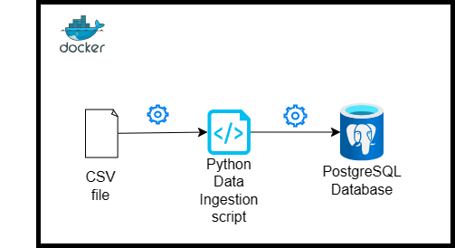

I started the data engineering bootcamp by [DataTalks](https://datatalks.club/) earlier this week. Containerization and Infrastructure as Code was covered. To gain a better understanding of what was taught I built a data pipeline using Docker. You can check out the project on my [GitHub](https://github.com/KenImade/data-ingestion-pipeline).



## Writing the Ingestion Script
To understand the structure of the data before ingestion and to test the data ingestion pipeline, I used Jupyter Notebooks and also setup a PostgreSQL database with Docker using the below command.

```
docker run -it \
    -e POSTGRES_USER=username \
    -e POSTGRES_PASSWORD=password \
    -e POSTGRES_DB=name of your database\
    -v directory where database will be persisted \
    -p 5432:5432 \
postgres:13
```

The command tells Docker to create a container which runs a Postgres database. The variables with the `-e` tag indicates environmental variables, `-v` which is the volume or the directory where the data being stored in the database will be persisted and `-p` the port through which we can access the database.

For the people reading who are a bit unfamiliar with Docker. Docker is a software that allows you to run a software packages in an environment called a container which is isolated from other environments. Unlike traditional virtual machines, containers do not bundle the entire operating system, making them lightweight and faster to launch. Docker ensures that applications run consistently across different environments by packaging them with their dependencies.

With the database setup, I focused on writing the ingestion script, the data which focused on the number of car owners in households in Italy was gotten from the EU Data portal. Exploring through the dataset I came up with a script which ingests the data into the postgres database in chunks of 20 rows.

```python
engine = create_engine(f"postgresql://{user}:{password}@{host}:{port}/{db}")

df_iter = pd.read_csv(csv_name, iterator=True, chunksize=20)

df = next(df_iter)

# drop unnecessary columns
df = df.drop(['Statistic Label', 'TLIST(A1)', 'UNIT'], axis=1)

# drop total rows
df = df[df['Number of Cars'] != 'Total']

df.head(n=0).to_sql(name=table_name, con=engine, if_exists='replace')

df.to_sql(name=table_name, con=engine, if_exists='append')

while True:

    t_start = time()

    df = next(df_iter)

    # drop unnecessary columns
    df = df.drop(['Statistic Label', 'TLIST(A1)', 'UNIT'], axis=1)

    # drop total rows
    df = df[df['Number of Cars'] != 'Total']

    df.to_sql(name=table_name, con=engine, if_exists='append')

    t_end = time()

    print('inserted another chunk..., took %.3f second(s)' % (t_end - t_start))
```

## Setting up the Environment
With the data ingestion script ready. The next step is to write the Dockerfile which would serve as the instructions on how the script would be run.

```docker
FROM python:3.12.2

RUN apt-get install wget
RUN pip install pandas sqlalchemy psycopg2

WORKDIR /app
COPY data_pipeline.py data_pipeline.py

ENTRYPOINT [ "python", "data_pipeline.py" ]
```
This instructions above tell Docker to use the Python version 3.12.2, install wget, pandas, sqlalchemy, and pyscopg2. Then create a directory called ***app*** then finally copy the data ingestion script into the environment and then run the script using the python environment.

## Composing a Docker Orchestra
A downside about running Docker containers is that you have to constantly write various long lines of command line or bash arguments to set them up. This is where docker-compose shines. Using a single YAML file we are able to write out what exatly we want to happen in our container. Take for example the configuration of a Postgres Database with PgAdmin when you try to run and connect them without the help of a docker-compose file.

Step One: You have to create a docker network so that both applications can communicate with each other
```
docker network pg-network
```

Step Two: Start the PostgreSQL Container, seems easy for now dosen't it?
```
docker run -d \
  --name dev-postgres \
  -e POSTGRES_PASSWORD=yourPassword \
  -e POSTGRES_USER=postgres \
  -e POSTGRES_DB=postgres \
  --network pg-network \
  -v postgres-data:/var/lib/postgresql/data \
  postgres
```

Step Three: Start the pgAdmin Container, what is happening here?
```
docker run -d \
  --name dev-pgadmin \
  -e PGADMIN_DEFAULT_EMAIL=yourEmail@example.com \
  -e PGADMIN_DEFAULT_PASSWORD=yourPassword \
  --network pg-network \
  -p 8080:80 \
  dpage/pgadmin4
```

Step Four: Connect pgAdmin to PostgreSQL using the credentials during setup, all this just to get connected?

Step Five: Get ready to write the above the next time you need that database.

Now compare the above to a docker-compose YAML file
```
services:
  postgres:
    image: postgres
    environment:
      POSTGRES_PASSWORD: yourPassword
      POSTGRES_USER: postgres
      POSTGRES_DB: postgres
    volumes:
      - postgres-data:/var/lib/postgresql/data
    networks:
      - pg-network

  pgadmin:
    image: dpage/pgadmin4
    depends_on:
      - postgres
    environment:
      PGADMIN_DEFAULT_EMAIL: yourEmail@example.com
      PGADMIN_DEFAULT_PASSWORD: yourPasswordForPgAdmin
    ports:
      - "8080:80"
    networks:
      - pg-network

networks:
  pg-network:
    driver: bridge

volumes:
  postgres-data:
```
Notice how simple it is with a docker-compose file setup. You only need two commands at your fingertips

```
docker-compose up -d
```
which sets up your environment and

```
docker-compose down
```
to bring it down.

## Conclusion
This guide has covered the end-to-end process of building a data pipeline using Docker, from writing the ingestion script to deploying it within a containerized environment. The skills and techniques demonstrated are applicable to a wide range of data engineering projects.

## Sidenote
While I didn't talk about security, readers should note that in a production environment credentials like database passwords, is managed through environment variables and never hard-coded.